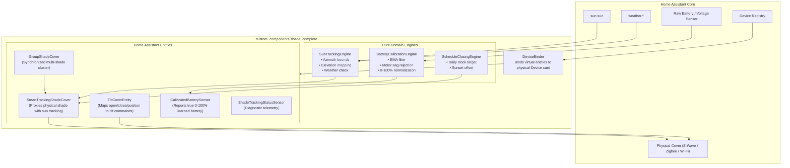

# 🏛️ ha-shade-complete Architecture

A unified Home Assistant custom integration delivering end-to-end smart shade management:
1. **Dynamic Solar Vector Tracking** (azimuth window containment, elevation mapping, weather suppression, and manual override arbitration).
2. **Virtual Tilt Projection** (transparent translation between standard cover commands and physical tilt mechanisms, co-locating on the native device card).
3. **Automated Scheduling** (daily scheduled closing and sunset offset dispatching).
4. **Adaptive Battery Calibration Engine** (online learning of nominal/extreme discharge boundaries with transient motor drop filtering).
5. **Unified Group Controller** (synchronized multi-cover dispatch and aggregated telemetry).

---

## 📐 Topology Diagram

---

## 🧩 Component Responsibilities

| Module | Responsibility |
| :--- | :--- |
| `engine/sun_engine.py` | Calculates solar incidence angles, azimuth tolerance with 360° wraparound, elevation-to-position curves, and weather suppression rules. |
| `engine/battery_engine.py` | Filters raw sensor telemetry with exponential smoothing, ignores transient voltage sag during motor actuation, dynamically learns min/max bounds, and yields a calibrated 0-100% state of charge. |
| `engine/schedule_engine.py` | Evaluates scheduled closing conditions per shade or group. |
| `device.py` | Extracts the underlying cover's `device_id` from the Home Assistant Entity Registry and creates a linked `DeviceInfo` descriptor. |
| `cover.py` | Houses the `SmartTrackingShadeCover`, `TiltCoverEntity`, and `GroupShadeCover` implementations. |
| `sensor.py` | Exposes `CalibratedBatterySensor` and `ShadeTrackingStatusSensor`. |
| `config_flow.py` | Step-by-step UI setup and dynamic Options Flow for runtime tuning. |
